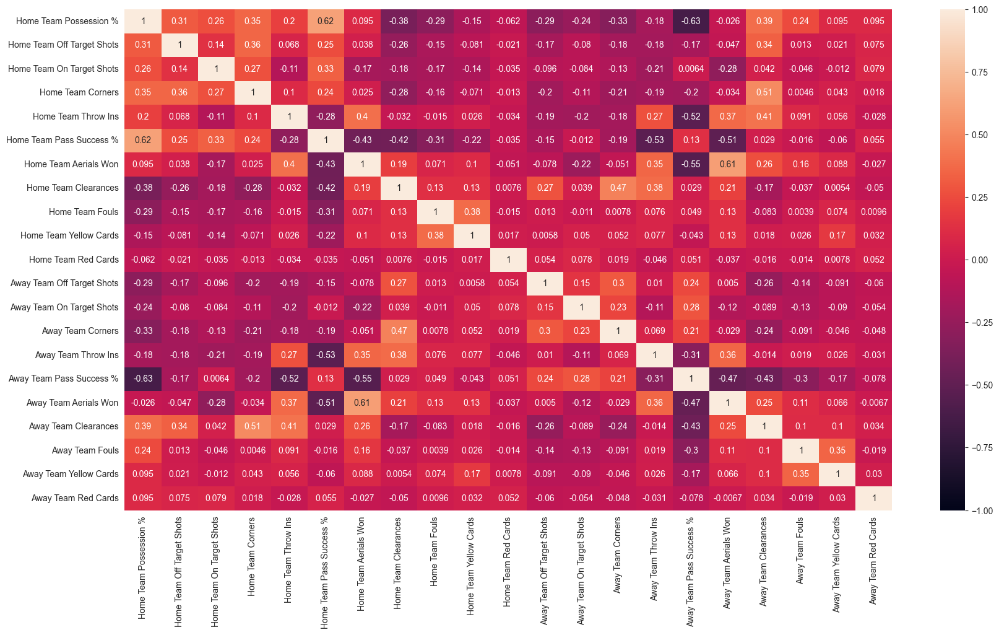

# Football-ml-predictor

<!-- TOC -->
* [Football-ml-predictor](#football-ml-predictor)
  * [Overview](#overview)
  * [Data Source](#data-source)
  * [Data Analysis and Feature Selection](#data-analysis-and-feature-selection)
  * [Training and Testing models](#training-and-testing-models)
<!-- TOC -->

---
## Overview
This is a project which aims to compare application of various supervised machine 
learning classification algorithms in prediction of football match outcomes. 
Programming language used for this project was Python.
---
## Data Source

After meticulous research I stumbled upon [this](https://www.kaggle.com/datasets/sanjeetsinghnaik/la-liga-match-data)
dataset containing data about LaLiga matches from 2014-2020. It's robust - 42 variables, very well formatted and
doesn't contain any missing data which made data preparation very easy.

Source: https://www.kaggle.com/datasets/sanjeetsinghnaik/la-liga-match-data

---
## Data Analysis and Feature Selection

Since the data was already clean, I then went onto data analysis phase of my project.

First I checked Home Win/Draw/Away Win distribution in the dataset.

After that, I decided to simplify the dataset by dropping non-relevant variables that weren't official match
stats e.g. _Match Excitement_ or _Year_.

I also decided to drop info about _Home and Away goals_ scored which directly dictated match outcome, using those stats
in machine learning models could've led to data leakage.

Last step was checking collinearity between variables and dropping ones that were heavily related.

After dropping some of the variables I generated another matrix which rendered much better results. 
These were also the final variables used in machine learning phase.

---

## Training and Testing models

For this project I used 5 following classification algorithms:
1. Naive Bayes Classifier
2. Decision Tree
3. Random Forest
4. Logistic Regression
5. K-Nearest Neighbors

I built two iterations of models - first iteration was with all default settings, in the second iteration I used 
GridSearchCV to find model parameters that would maximize accuracy of each classifier. In the end both results were compared.

This is a preview of some of the obtained results:

Overall the highest reached accuracy was 68,4% for random forest model. 
The least effective was KNN with only 59,2% accuracy. 
4 out 5 classifiers had reached over 60% accuracy in predicting final match outcome, this value was commonly observed in 
other experiments that I analyzed prior to this project.

Modifying parameters with grid search allowed weaker models to catch up to stronger ones
and reduced differences between classifiers.

